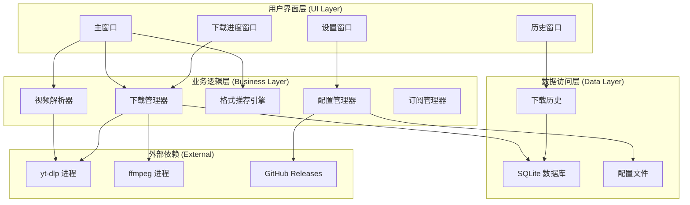
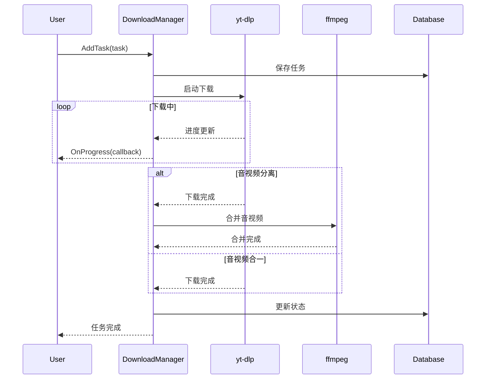

# VDD 视频下载工具 - 技术设计文档

## 技术选型

### 核心技术栈

| 技术       | 版本   | 用途         | 选型理由                   |
| ---------- | ------ | ------------ | -------------------------- |
| **Go**     | 1.21+  | 主开发语言   | 跨平台、高性能、单文件部署 |
| **Fyne**   | v2.4+  | GUI 框架     | 原生体验、跨平台、活跃社区 |
| **yt-dlp** | Latest | 视频解析下载 | 支持 1800+ 网站、持续更新  |
| **ffmpeg** | 6.0+   | 音视频处理   | 业界标准、功能强大         |
| **SQLite** | 3.x    | 本地数据库   | 轻量级、零配置、跨平台     |

### 第三方库

```go
// Go 依赖
fyne.io/fyne/v2                 // GUI 框架
github.com/mattn/go-sqlite3     // SQLite 驱动
github.com/spf13/viper          // 配置管理
golang.org/x/net/proxy          // 代理支持
github.com/dgrijalva/jwt-go     // JWT Token
```

---

## 系统架构

### 架构图



### 分层设计

#### 1. UI 层 (ui/)

负责所有界面交互，基于 Fyne 框架

#### 2. 业务层 (core/)

核心业务逻辑，不依赖具体 UI 实现

#### 3. 数据层 (data/)

数据持久化和配置管理

#### 4. 工具层 (utils/)

通用工具函数

---

## 模块设计

### 1. 视频解析器 (core/parser)

#### 功能

- 调用 yt-dlp 解析视频信息
- 解析 JSON 输出
- 提取格式列表

#### 核心接口

```go
type VideoParser interface {
    // 解析视频信息
    ParseVideo(url string) (*VideoInfo, error)

    // 获取所有格式
    GetFormats(url string) ([]Format, error)

    // 检查 yt-dlp 版本
    CheckVersion() (string, error)

    // 更新 yt-dlp
    UpdateYtDlp() error
}

type VideoInfo struct {
    ID          string    `json:"id"`
    Title       string    `json:"title"`
    Uploader    string    `json:"uploader"`
    Duration    int       `json:"duration"`
    Thumbnail   string    `json:"thumbnail"`
    Description string    `json:"description"`
    Formats     []Format  `json:"formats"`
}

type Format struct {
    FormatID    string  `json:"format_id"`
    Extension   string  `json:"ext"`           // mp4, webm
    Resolution  string  `json:"resolution"`    // 1920x1080
    FPS         float64 `json:"fps"`
    VCodec      string  `json:"vcodec"`        // h264, vp9
    ACodec      string  `json:"acodec"`        // aac, opus
    ABitRate    int     `json:"abr"`
    VBitRate    int     `json:"vbr"`
    FileSize    int64   `json:"filesize"`
    HasVideo    bool    // 是否包含视频
    HasAudio    bool    // 是否包含音频
}
```

#### 实现细节

**调用 yt-dlp**：

```bash
yt-dlp --dump-json <URL>
```

**解析输出**：

- 使用 `encoding/json` 解析标准输出
- 处理错误和异常情况

### 2. 格式推荐引擎 (core/recommender)

#### 功能

- 根据规则排序格式
- 标记推荐项

#### 推荐算法

```go
type FormatRecommender struct {
    preferences UserPreferences
}

type UserPreferences struct {
    PreferredResolution string   // "1080p", "720p"
    PreferredFormat     string   // "mp4", "webm"
    PreferredCodec      string   // "h264", "vp9"
    AudioOnly           bool
}

func (r *FormatRecommender) Recommend(formats []Format) []Format {
    // 1. 过滤：移除只有视频或只有音频的（除非用户特意选择）
    filtered := filterCombinedFormats(formats)

    // 2. 评分
    scored := make([]ScoredFormat, len(filtered))
    for i, f := range filtered {
        scored[i] = ScoredFormat{
            Format: f,
            Score:  calculateScore(f, r.preferences),
        }
    }

    // 3. 排序
    sort.Slice(scored, func(i, j int) bool {
        return scored[i].Score > scored[j].Score
    })

    // 4. 标记推荐
    if len(scored) > 0 {
        scored[0].Recommended = true
    }

    return extractFormats(scored)
}

func calculateScore(f Format, prefs UserPreferences) float64 {
    score := 0.0

    // 分辨率分数 (30%)
    score += resolutionScore(f.Resolution) * 0.3

    // 格式分数 (20%)
    score += formatScore(f.Extension) * 0.2

    // 编码分数 (20%)
    score += codecScore(f.VCodec, f.ACodec) * 0.2

    // 音视频完整性 (30%)
    if f.HasVideo && f.HasAudio {
        score += 0.3
    }

    return score
}
```

### 3. 下载管理器 (core/downloader)

#### 功能

- 管理下载任务队列
- 监控下载进度
- 音视频合并

#### 核心接口

```go
type DownloadManager interface {
    // 添加下载任务
    AddTask(task *DownloadTask) error

    // 暂停任务
    PauseTask(taskID string) error

    // 继续任务
    ResumeTask(taskID string) error

    // 取消任务
    CancelTask(taskID string) error

    // 获取所有任务
    GetTasks() []*DownloadTask

    // 监听进度
    OnProgress(callback ProgressCallback)
}

type DownloadTask struct {
    ID           string
    URL          string
    Format       Format
    OutputPath   string
    Status       TaskStatus
    Progress     float64    // 0-100
    Speed        int64      // bytes/s
    Downloaded   int64      // bytes
    Total        int64      // bytes
    ETA          int        // seconds
    CreatedAt    time.Time
    UpdatedAt    time.Time
}

type TaskStatus int

const (
    StatusPending TaskStatus = iota
    StatusDownloading
    StatusPaused
    StatusMerging
    StatusCompleted
    StatusFailed
    StatusCanceled
)

type ProgressCallback func(task *DownloadTask)
```

#### 下载流程



#### 实现细节

**并发控制**：

```go
type DownloadPool struct {
    maxWorkers int
    queue      chan *DownloadTask
    workers    []*Worker
}

func (p *DownloadPool) Start() {
    for i := 0; i < p.maxWorkers; i++ {
        worker := NewWorker(i, p.queue)
        p.workers = append(p.workers, worker)
        go worker.Start()
    }
}
```

**进度解析**：

```go
// 解析 yt-dlp 输出
// [download]  45.2% of 234.5MiB at 1.2MiB/s ETA 02:34
func parseProgress(line string) Progress {
    re := regexp.MustCompile(`\[download\]\s+(\d+\.?\d*)%.*?(\d+\.?\d*\w+iB).*?(\d+\.?\d*\w+iB/s).*?ETA\s+(\d+:\d+)`)
    matches := re.FindStringSubmatch(line)
    // ...
}
```

### 4. 配置管理器 (core/config)

#### 配置文件结构 (config.yaml)

```yaml
# 基础设置
download:
  directory: "~/Downloads"
  max_concurrent: 3
  auto_download: false
  speed_limit: 0 # 0 = 无限制，单位 KB/s

# 文件命名
naming:
  template: "{title}_{resolution}.{ext}"

# 网络设置
network:
  proxy:
    enabled: false
    type: "http" # http, socks5
    host: "127.0.0.1"
    port: 7890
  user_agent: "Mozilla/5.0..."
  cookies_file: ""

# 质量预设
quality:
  preset: "balanced" # max, balanced, min, audio_only, custom
  custom:
    resolution: "1080p"
    format: "mp4"
    codec: "h264"

# 字幕设置
subtitles:
  download: true
  languages: ["zh-CN", "en"]
  embed: false

# 界面设置
ui:
  theme: "system" # light, dark, system
  language: "zh-CN"

# Open Source
open_source:
  enabled: true
  activation_required: false
```

#### 接口设计

```go
type ConfigManager interface {
    Load() error
    Save() error
    Get(key string) interface{}
    Set(key string, value interface{}) error
    GetDownloadDir() string
    SetDownloadDir(dir string) error
}
```

### 5. 开源模式

#### 说明

- 当前版本为开源版，不再包含激活与授权限制。
- 所有下载与订阅功能默认可用。
- 与授权相关的服务端和校验逻辑已移除。

### 6. UI 层设计 (ui/)

#### 主窗口布局

```
┌──────────────────────────────────────────────┐
│  VDD 视频下载工具                      [设置] │
├──────────────────────────────────────────────┤
│  视频链接                                     │
│  ┌──────────────────────────────────┐  [解析]│
│  │ https://www.youtube.com/...     │         │
│  └──────────────────────────────────┘         │
├──────────────────────────────────────────────┤
│  视频信息：                                   │
│  📺 标题：Example Video                       │
│  👤 作者：Channel Name                        │
│  ⏱️  时长：10:24                              │
├──────────────────────────────────────────────┤
│  可用格式：                                   │
│  ┌──────────────────────────────────────────┐│
│  │☑ ⭐ 1080p  MP4  H.264/AAC  245.6MB [⬇]  ││
│  │☐    720p   MP4  H.264/AAC  128.3MB [⬇]  ││
│  │☐    480p   WebM VP9/Opus    89.2MB [⬇]  ││
│  │☐ 🎵 Audio  M4A  AAC         12.5MB [⬇]  ││
│  └──────────────────────────────────────────┘│
│                                               │
│              [下载选中] [批量导入]  [历史]    │
└──────────────────────────────────────────────┘
```

#### Fyne 组件映射

```go
type MainWindow struct {
    window    fyne.Window
    urlEntry  *widget.Entry
    parseBtn  *widget.Button
    videoInfo *fyne.Container
    formatList *widget.List
    downloadBtn *widget.Button
}

func (m *MainWindow) Build() {
    // URL 输入区
    urlEntry := widget.NewEntry()
    urlEntry.SetPlaceHolder("粘贴视频链接...")

    parseBtn := widget.NewButton("解析", m.onParse)

    // 格式列表
    formatList := widget.NewList(
        func() int { return len(m.formats) },
        func() fyne.CanvasObject {
            return container.NewHBox(
                widget.NewCheck("", nil),
                widget.NewLabel("1080p"),
                widget.NewLabel("MP4"),
                widget.NewLabel("245.6 MB"),
                widget.NewButton("下载", nil),
            )
        },
        func(id widget.ListItemID, obj fyne.CanvasObject) {
            // 更新数据
        },
    )

    // 布局
    content := container.NewBorder(
        container.NewVBox(
            container.NewBorder(nil, nil, nil, parseBtn, urlEntry),
            m.videoInfo,
        ),
        container.NewHBox(
            widget.NewButton("下载选中", m.onDownload),
            widget.NewButton("批量导入", m.onBatchImport),
            widget.NewButton("历史", m.onHistory),
        ),
        nil, nil,
        formatList,
    )

    m.window.SetContent(content)
}
```

---

## 数据模型

### 数据库 Schema (SQLite)

```sql
-- 下载历史
CREATE TABLE download_history (
    id INTEGER PRIMARY KEY AUTOINCREMENT,
    video_id TEXT NOT NULL,
    title TEXT NOT NULL,
    url TEXT NOT NULL,
    format_id TEXT NOT NULL,
    resolution TEXT,
    file_path TEXT NOT NULL,
    file_size INTEGER,
    downloaded_at DATETIME DEFAULT CURRENT_TIMESTAMP
);

CREATE INDEX idx_video_id ON download_history(video_id);
CREATE INDEX idx_downloaded_at ON download_history(downloaded_at);

-- License 信息
CREATE TABLE license_info (
    id INTEGER PRIMARY KEY,
    license_key TEXT UNIQUE NOT NULL,
    machine_id TEXT NOT NULL,
    activated_at DATETIME,
    expire_at DATETIME,
    is_active BOOLEAN DEFAULT 0
);
```

---

## 文件结构

```
vdd/
├── main.go                 # 入口文件
├── go.mod
├── go.sum
├── README.md
├── LICENSE
├── .gitignore
│
├── assets/                 # 资源文件
│   ├── icon.png
│   └── bundled/
│       ├── yt-dlp          # 内置 yt-dlp
│       └── ffmpeg          # 内置 ffmpeg
│
├── core/                   # 业务逻辑层
│   ├── parser/
│   │   ├── parser.go
│   │   └── parser_test.go
│   ├── downloader/
│   │   ├── manager.go
│   │   ├── task.go
│   │   ├── pool.go
│   │   └── progress.go
│   ├── recommender/
│   │   ├── recommender.go
│   │   └── scorer.go
│   ├── config/
│   │   ├── config.go
│   │   └── defaults.go
│   └── license/
│       ├── validator.go
│       ├── activator.go
│       └── machine.go
│
├── ui/                     # UI 层
│   ├── main_window.go
│   ├── settings_window.go
│   ├── history_window.go
│   ├── progress_window.go
│   ├── license_window.go
│   └── widgets/
│       ├── format_item.go
│       └── progress_bar.go
│
├── data/                   # 数据层
│   ├── database.go
│   ├── history.go
│   └── migrations/
│       └── 001_init.sql
│
├── utils/                  # 工具函数
│   ├── file.go
│   ├── format.go          # 文件大小格式化
│   ├── path.go
│   └── http.go            # HTTP 工具
│
└── build/                  # 构建脚本
    ├── build.sh
    ├── package-windows.sh
    ├── package-macos.sh
    └── package-linux.sh
```

---

## 技术难点与解决方案

### 1. yt-dlp 版本管理

**问题**：视频网站频繁更新，yt-dlp 需要及时跟进

**解决方案**：

- 内置特定版本的 yt-dlp
- 提供一键更新功能
- 定期检查更新（可选）

```go
func UpdateYtDlp() error {
    url := "https://github.com/yt-dlp/yt-dlp/releases/latest/download/yt-dlp"

    // 下载最新版本
    resp, err := http.Get(url)
    // ...

    // 替换二进制文件
    os.Rename("yt-dlp.new", "yt-dlp")
    os.Chmod("yt-dlp", 0755)

    return nil
}
```

### 2. 跨平台进程管理

**问题**：Windows/Linux/macOS 进程调用差异

**解决方案**：

```go
func getYtDlpPath() string {
    if runtime.GOOS == "windows" {
        return filepath.Join(getAppDir(), "yt-dlp.exe")
    }
    return filepath.Join(getAppDir(), "yt-dlp")
}

func executeYtDlp(args ...string) (*exec.Cmd, error) {
    cmd := exec.Command(getYtDlpPath(), args...)

    // Windows 隐藏控制台窗口
    if runtime.GOOS == "windows" {
        cmd.SysProcAttr = &syscall.SysProcAttr{
            HideWindow: true,
        }
    }

    return cmd, nil
}
```

### 3. 大文件下载管理

**问题**：内存占用、断点续传

**解决方案**：

- 使用流式处理，避免全部加载到内存
- yt-dlp 自带断点续传支持
- 监控磁盘空间

```go
func (d *Downloader) checkDiskSpace(path string, required int64) error {
    var stat syscall.Statfs_t
    syscall.Statfs(path, &stat)

    available := stat.Bavail * uint64(stat.Bsize)
    if available < uint64(required) {
        return fmt.Errorf("磁盘空间不足")
    }

    return nil
}
```

### 4. License 服务器设计

**API 设计**：

```
POST /api/v1/license/activate
Request:
{
  "license_key": "VDD-XXXX-XXXX-XXXX-XXXX",
  "machine_id": "abc123...",
  "device_name": "MacBook Pro"
}

Response:
{
  "success": true,
  "token": "eyJhbGc...",
  "expire_at": "2025-12-31T23:59:59Z",
  "devices_used": 1,
  "devices_limit": 3
}
```

**服务器技术栈**：

- Go + Gin Framework
- PostgreSQL
- Redis (Token 缓存)
- HTTPS + API Key 认证

---

## 性能优化

### 1. 解析优化

- 缓存视频信息（5 分钟）
- 并发解析播放列表

### 2. UI 优化

- 虚拟列表（格式列表很长时）
- 异步加载缩略图

### 3. 下载优化

- 分片下载（yt-dlp 内置）
- 连接复用
- 智能限速

---

## 安全考虑

### 1. 配置文件加密

```go
func EncryptConfig(data []byte, key []byte) ([]byte, error) {
    block, _ := aes.NewCipher(key)
    gcm, _ := cipher.NewGCM(block)
    nonce := make([]byte, gcm.NonceSize())
    io.ReadFull(rand.Reader, nonce)
    return gcm.Seal(nonce, nonce, data, nil), nil
}
```

### 2. License Key 保护

- 本地存储加密
- 通信使用 HTTPS
- 定期验证（每 24 小时）

### 3. 代码混淆

使用 `garble` 工具混淆编译：

```bash
garble -literals -tiny build
```

---

## 部署方案

### 打包工具

- **Windows**: `fyne package -os windows -icon icon.png`
- **macOS**: `fyne package -os darwin -icon icon.png`
- **Linux**: `fyne package -os linux -icon icon.png`

### 资源嵌入

```go
//go:embed assets/yt-dlp
var ytdlpBinary []byte

//go:embed assets/ffmpeg
var ffmpegBinary []byte

func extractBinaries() error {
    os.WriteFile(getYtDlpPath(), ytdlpBinary, 0755)
    os.WriteFile(getFFmpegPath(), ffmpegBinary, 0755)
    return nil
}
```

### 自动更新

- 使用 GitHub Releases
- 客户端检查更新
- 可选自动下载安装

---

## 测试策略

### 单元测试

- 每个模块独立测试
- 覆盖率 > 80%

### 集成测试

- 端到端下载流程
- 多平台测试

### 手动测试

- 主流视频网站测试
- UI 交互测试
- 跨平台兼容性测试
