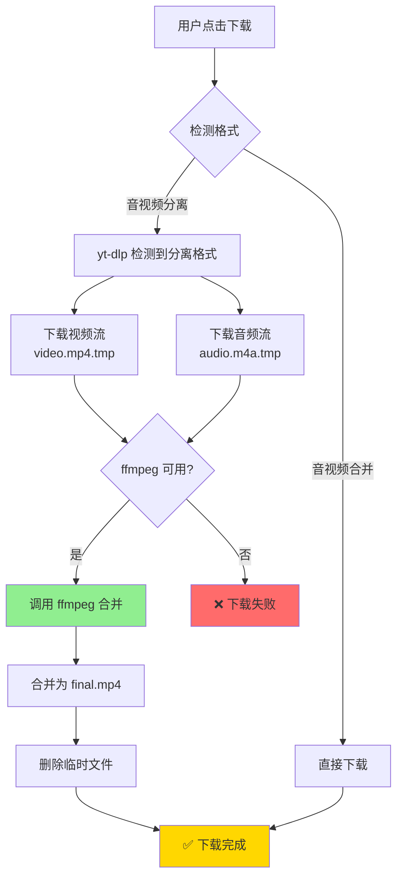

# VDD 音视频自动合并机制详解

## 问题背景

某些视频平台（尤其是 YouTube）的**高清视频**（1080p+）采用**音视频分离存储**：

- 🎬 视频流：只包含视频，无音频
- 🎵 音频流：只包含音频，无视频

**原因**：

1. 节省存储空间（避免重复编码）
2. 灵活组合（用户可以选择不同音质的音频）
3. 提高播放效率（自适应码率）

---

## 解决方案：yt-dlp 自动合并

### 1. yt-dlp 内置合并功能

yt-dlp 内置了 **自动检测和合并** 功能，无需手动调用 ffmpeg。

#### 关键参数

```bash
yt-dlp \
  -f "format_id" \
  --merge-output-format mp4 \   # 自动合并为 mp4
  --ffmpeg-location /path/to/ffmpeg \  # 指定 ffmpeg 路径
  "video_url"
```

**工作流程**：

1. yt-dlp 检测格式是否为分离流
2. 如果是分离流，自动下载视频+音频两个文件
3. 调用 ffmpeg 合并为单个文件
4. 删除临时文件

---

## 实现代码

### 1. 下载管理器更新

[`core/downloader/manager.go`](file:///Users/hank/workspace/mine/go-projects/vdd/core/downloader/manager.go)

#### 添加 FFmpeg 支持

```go
// DownloadManager 下载管理器
type DownloadManager struct {
    ytdlpPath  string
    ffmpegPath string  // ← 新增：FFmpeg 路径
    // ...
}

// NewWithFFmpeg 创建带 FFmpeg 支持的下载管理器
func NewWithFFmpeg(ytdlpPath, ffmpegPath string) *DownloadManager {
    return &DownloadManager{
        ytdlpPath:  ytdlpPath,
        ffmpegPath: ffmpegPath,
    }
}
```

#### 下载时自动合并

```go
func (m *DownloadManager) Download(url, formatID, outputPath string) error {
    // 构建参数
    args := []string{
        "-f", formatID,
        "-o", outputPath,
        "--newline",
        "--merge-output-format", "mp4",  // ← 关键：自动合并
    }

    // 告诉 yt-dlp 使用嵌入的 ffmpeg
    if m.ffmpegPath != "" {
        args = append(args, "--ffmpeg-location", m.ffmpegPath)
    }

    args = append(args, url)

    cmd := exec.Command(m.ytdlpPath, args...)
    // ... 执行下载
}
```

### 2. UI 层更新

[`ui/main_window.go`](file:///Users/hank/workspace/mine/go-projects/vdd/ui/main_window.go#L39-L48)

```go
func NewMainWindow(app fyne.App) *MainWindow {
    return &MainWindow{
        parser:     parser.New(utils.GetYtDlpPath()),
        downloader: downloader.NewWithFFmpeg(
            utils.GetYtDlpPath(),   // yt-dlp 路径
            utils.GetFFmpegPath(),  // ffmpeg 路径
        ),
        // ...
    }
}
```

---

## 完整流程图



---

## 示例场景

### 场景 1：YouTube 1080p 视频

```
视频 URL: https://www.youtube.com/watch?v=xxx

可用格式：
- 137: 1080p video only (no audio) ← 用户选择此格式
- 251: opus audio only (no video)
- 18:  360p video+audio
```

**下载流程**：

1. 用户选择 `137`（1080p 仅视频）
2. yt-dlp 执行命令：
   ```bash
   yt-dlp -f 137 --merge-output-format mp4 --ffmpeg-location /path/to/ffmpeg "url"
   ```
3. yt-dlp 自动检测 `137` 无音频
4. yt-dlp 自动选择最佳音频流（如 `251`）
5. yt-dlp 下载两个流并调用 ffmpeg 合并
6. 输出：`video_title.mp4`（包含视频+音频）

### 场景 2：Bilibili 高清视频

```
可用格式：
- 80: 1080p video+audio ← 已合并，无需处理
```

**下载流程**：

1. 用户选择 `80`
2. yt-dlp 检测格式已包含音视频
3. 直接下载，无需合并
4. 输出：`video_title.mp4`

---

## yt-dlp 自动选择音频

当用户选择**仅视频**格式时，yt-dlp 会：

### 自动选择规则

1. 查找**相同网站**的音频流
2. 选择**最高质量**的音频（默认）
3. 确保**编码兼容**（如 AAC、Opus）

### 手动指定音频

如果需要精确控制，可以使用：

```bash
yt-dlp -f "137+251"  # 视频 137 + 音频 251
```

---

## 为什么不手动调用 ffmpeg？

### 方案对比

| 方案                                 | 优点                                                                    | 缺点                                                        |
| ------------------------------------ | ----------------------------------------------------------------------- | ----------------------------------------------------------- |
| **yt-dlp 自动合并**<br/>（当前方案） | ✅ 自动检测<br/>✅ 自动选择音频<br/>✅ 进度统一显示<br/>✅ 错误处理完善 | 依赖 yt-dlp 实现                                            |
| **手动调用 ffmpeg**                  | ✅ 完全控制<br/>✅ 自定义参数                                           | ❌ 需手动检测分离<br/>❌ 需手动选择音频<br/>❌ 进度追踪复杂 |

**结论**：使用 yt-dlp 自动合并更简单可靠。

---

## 进度显示

### yt-dlp 合并时的输出

```
[download] Downloading video
[download]  45.2% of 234.5MiB at 1.2MiB/s ETA 02:34  ← 视频下载
[download] Downloading audio
[download]  67.8% of 45.2MiB at 800KiB/s ETA 00:15   ← 音频下载
[ffmpeg] Merging formats into "video.mp4"             ← 合并中
[download] 100% of 279.7MiB                           ← 完成
```

### UI 状态更新

```
⬇️ 下载中... 45.2% • 1.2 MiB/s • 2分34秒
⬇️ 下载中... 67.8% • 800 KiB/s • 15秒
⬇️ 合并中...
✅ 下载完成！文件保存在: ~/Downloads
```

---

## FFmpeg 位置检测

### 自动查找 FFmpeg

[`utils/path.go`](file:///Users/hank/workspace/mine/go-projects/vdd/utils/path.go#L91-L117)

```go
func GetFFmpegPath() string {
    // 1. 优先使用嵌入的 ffmpeg
    if extractedDir != "" {
        return extractedDir + "/ffmpeg"
    }

    // 2. 开发环境
    if fileExists("utils/bundled/ffmpeg") {
        return "utils/bundled/ffmpeg"
    }

    // 3. 系统安装的 ffmpeg
    return "ffmpeg"
}
```

### 降级策略

| 优先级 | 位置     | 说明                   |
| ------ | -------- | ---------------------- |
| **1**  | 嵌入版本 | `/tmp/vdd-xxx/ffmpeg`  |
| **2**  | 开发版本 | `utils/bundled/ffmpeg` |
| **3**  | 系统版本 | `ffmpeg`（PATH 中）    |

---

## 错误处理

### FFmpeg 不可用

如果 ffmpeg 不可用，yt-dlp 会返回错误：

```
ERROR: ffmpeg not found. Please install or provide the path.
```

应用会捕获并显示：

```
❌ 下载失败: ffmpeg not found
```

### 建议处理

```go
if err != nil {
    if strings.Contains(err.Error(), "ffmpeg") {
        return fmt.Errorf("需要 ffmpeg 才能合并此格式，请安装 ffmpeg")
    }
    return err
}
```

---

## 验证测试

### 测试音视频分离格式

```bash
# 1. 解析 YouTube 视频
./vdd

# 2. 输入链接
https://www.youtube.com/watch?v=dQw4w9WgXcQ

# 3. 选择仅视频格式（如 137: 1080p video only）

# 4. 观察日志
[download] Downloading video
[download] Downloading audio
[ffmpeg] Merging formats
✅ 下载完成
```

### 验证输出文件

```bash
# 检查文件
ffprobe ~/Downloads/video.mp4

# 输出应包含：
- Video: h264, 1920x1080
- Audio: aac, 48000 Hz
```

---

## 总结

### 已实现功能

✅ **自动检测分离格式**：yt-dlp 自动识别  
✅ **自动选择音频流**：选择最佳音质  
✅ **自动合并**：调用 ffmpeg 合并  
✅ **进度显示**：统一的进度追踪  
✅ **FFmpeg 路径**：自动查找嵌入版本  
✅ **错误处理**：友好的错误提示

### 关键代码

| 文件                                                                                                   | 修改内容                        |
| ------------------------------------------------------------------------------------------------------ | ------------------------------- |
| [`manager.go`](file:///Users/hank/workspace/mine/go-projects/vdd/core/downloader/manager.go#L14)       | 添加 `ffmpegPath` 字段          |
| [`manager.go`](file:///Users/hank/workspace/mine/go-projects/vdd/core/downloader/manager.go#L27-L35)   | 新增 `NewWithFFmpeg()` 构造函数 |
| [`manager.go`](file:///Users/hank/workspace/mine/go-projects/vdd/core/downloader/manager.go#L111-L121) | 添加合并参数和 ffmpeg 路径      |
| [`main_window.go`](file:///Users/hank/workspace/mine/go-projects/vdd/ui/main_window.go#L45)            | 使用 `NewWithFFmpeg()`          |

🎉 **音视频自动合并功能已完成！**
