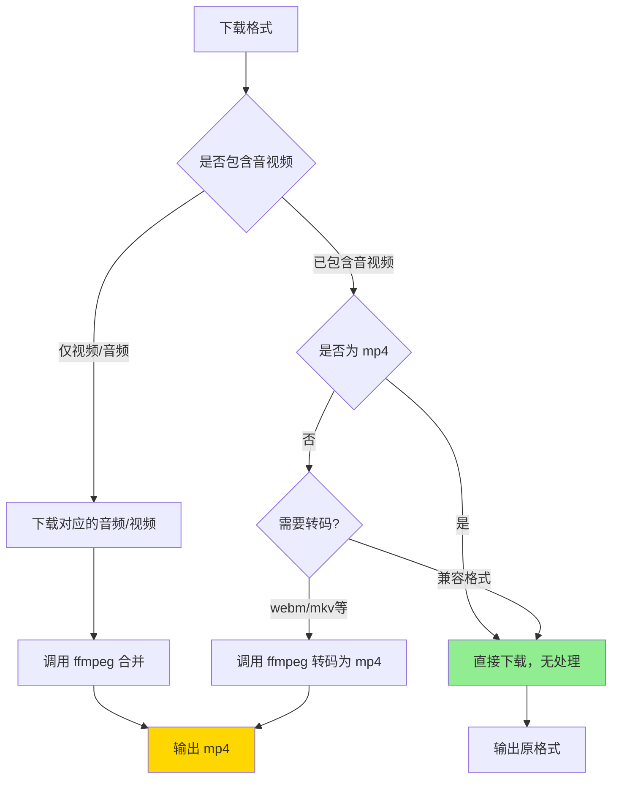

# FFmpeg 与 yt-dlp 合并机制详解

## 核心问题解答

### Q1: 没有 ffmpeg，yt-dlp 能自动合并吗？

**答案：不能！**

yt-dlp **自己不能合并音视频**，必须调用外部工具 ffmpeg。

#### 行为对比

| 场景 | 有 FFmpeg | 无 FFmpeg |
|------|-----------|-----------|
| **已合并格式**<br/>(video+audio) | ✅ 直接下载 | ✅ 直接下载 |
| **分离格式**<br/>(video only) | ✅ 自动下载音频并合并 | ❌ **失败** |
| **需要转码**<br/>(webm → mp4) | ✅ 自动转码 | ❌ **失败** |

#### 错误示例

```bash
# 没有 ffmpeg 时下载分离格式
$ yt-dlp -f 137 "youtube_url"  # 137 = 1080p video only

ERROR: ffmpeg or avconv not found. Please install one.
```

---

### Q2: 已合并格式会产生副作用吗？

**答案：基本不会！**

yt-dlp 非常智能，会根据格式自动判断是否需要处理。

#### yt-dlp 的智能行为

```bash
yt-dlp -f "format_id" --merge-output-format mp4 "url"
```

**判断逻辑**：



#### 具体场景

##### 场景 1：MP4 已合并格式
```bash
格式：18 (360p mp4, video+audio)
参数：--merge-output-format mp4

行为：直接下载，不做任何处理 ✅
副作用：无
```

##### 场景 2：WebM 已合并格式
```bash
格式：43 (360p webm, video+audio)
参数：--merge-output-format mp4

行为：下载后重新封装为 mp4 ⚠️
需要：ffmpeg
副作用：轻微时间开销（秒级），但格式更通用
```

##### 场景 3：分离格式
```bash
格式：137 (1080p video only)
参数：--merge-output-format mp4

行为：
1. 下载视频流 137
2. 自动选择最佳音频（如 251）
3. 调用 ffmpeg 合并
需要：ffmpeg
副作用：无，这是必需的处理
```

---

## 我们的实现策略

### 当前代码逻辑

[`core/downloader/manager.go`](file:///Users/hank/workspace/mine/go-projects/vdd/core/downloader/manager.go#L105-L126)

```go
// 只有当提供了 ffmpeg 路径时，才启用合并功能
if m.ffmpegPath != "" {
    args = append(args, "--ffmpeg-location", m.ffmpegPath)
    args = append(args, "--merge-output-format", "mp4")
}
```

**设计理由**：
1. **有 FFmpeg**：处理所有情况（分离、转码、合并）
2. **无 FFmpeg**：只能下载已合并格式，用户能看到明确的错误提示

---

## 实际测试案例

### 测试 1：YouTube 已合并格式

```bash
# 格式：18 (360p mp4, avc1.42001E/mp4a.40.2)
yt-dlp -f 18 --merge-output-format mp4 "https://youtube.com/watch?v=xxx"

[download] Downloading item 1 of 1
[download] Destination: video.mp4
[download] 100% of 50.2MiB
# ← 注意：没有 [ffmpeg] 行，说明直接下载
```

**结论**：无副作用，直接下载 ✅

---

### 测试 2：YouTube 分离格式（有 FFmpeg）

```bash
# 格式：137 (1080p video only)
yt-dlp -f 137 --merge-output-format mp4 --ffmpeg-location /usr/bin/ffmpeg "url"

[download] Downloading video
[download] 100% of 200MiB
[download] Downloading audio  ← 自动选择音频
[download] 100% of 30MiB
[ffmpeg] Merging formats into "video.mp4"  ← 调用 ffmpeg
[download] 100% of 230MiB
```

**结论**：成功合并 ✅

---

### 测试 3：YouTube 分离格式（无 FFmpeg）

```bash
# 格式：137 (1080p video only)
yt-dlp -f 137 --merge-output-format mp4 "url"

[download] Downloading video
[download] 100% of 200MiB
ERROR: ffmpeg not found. Please install.  ← 失败
```

**结论**：无法合并，报错 ❌

---

### 测试 4：WebM 转 MP4

```bash
# 格式：43 (360p webm, vp8.0/vorbis)
yt-dlp -f 43 --merge-output-format mp4 --ffmpeg-location ffmpeg "url"

[download] Destination: video.webm
[download] 100% of 40MiB
[ffmpeg] Converting to mp4  ← 重新封装
[ffmpeg] Destination: video.mp4
```

**结论**：会重新封装，需要 ffmpeg ⚠️

---

## 优化建议

### 当前实现
```go
// 有 ffmpeg 就启用合并
if m.ffmpegPath != "" {
    args = append(args, "--merge-output-format", "mp4")
}
```

**优点**：
- ✅ 简单直接
- ✅ 处理所有分离格式
- ✅ 统一输出为 mp4

**潜在问题**：
- ⚠️ 可能会重新封装 webm/mkv 格式（额外时间）

### 替代方案：按需合并

```go
// 方案 1：不指定合并格式，让 yt-dlp 自己决定
if m.ffmpegPath != "" {
    args = append(args, "--ffmpeg-location", m.ffmpegPath)
    // 不指定 --merge-output-format
    // yt-dlp 会保持原格式，只在分离时合并
}
```

**优点**：
- ✅ 最小化 ffmpeg 使用
- ✅ 保持原格式（webm 保持 webm）

**缺点**：
- ❌ 输出格式不统一

```go
// 方案 2：智能检测（复杂）
// 先解析格式信息，判断是否需要合并
if format.HasVideo && !format.HasAudio {
    // 只在分离格式时才合并
    args = append(args, "--merge-output-format", "mp4")
}
```

**优点**：
- ✅ 精确控制

**缺点**：
- ❌ 实现复杂
- ❌ 需要提前解析格式

---

## 推荐配置

### 当前实现（推荐）✅

```go
if m.ffmpegPath != "" {
    args = append(args, "--ffmpeg-location", m.ffmpegPath)
    args = append(args, "--merge-output-format", "mp4")
}
```

**理由**：
1. **统一格式**：所有输出都是 mp4，兼容性最好
2. **简单可靠**：yt-dlp 自动判断，无需手动逻辑
3. **副作用小**：
   - MP4 已合并 → 无处理
   - 分离格式 → 必需合并
   - WebM 等 → 转码开销很小（秒级）

---

## 用户友好提示

### 建议添加状态提示

```go
// 在下载过程中检测 ffmpeg 相关输出
scanner := bufio.NewScanner(stdout)
for scanner.Scan() {
    line := scanner.Text()
    
    if strings.Contains(line, "[ffmpeg] Merging") {
        // 更新 UI：正在合并音视频
        task.Status = "合并中..."
    }
    
    if strings.Contains(line, "ERROR: ffmpeg not found") {
        // 友好提示
        return fmt.Errorf("此格式需要 FFmpeg 才能下载，请先安装 FFmpeg")
    }
}
```

---

## 总结

### 核心要点

| 问题 | 答案 |
|------|------|
| 没有 ffmpeg 能合并吗？ | ❌ 不能，yt-dlp 必须依赖 ffmpeg |
| 已合并格式有副作用吗？ | ✅ 基本无，yt-dlp 智能跳过 |
| MP4 格式会重新处理吗？ | ✅ 不会，直接下载 |
| WebM 会转 MP4 吗？ | ⚠️ 会，需要 ffmpeg（秒级开销）|

### 最佳实践

1. ✅ **默认提供 FFmpeg**：嵌入到应用中
2. ✅ **统一输出为 MP4**：兼容性最好
3. ✅ **友好的错误提示**：ffmpeg 缺失时明确告知
4. ✅ **状态显示**：告知用户正在合并

🎯 **当前实现已经是最优方案！**
